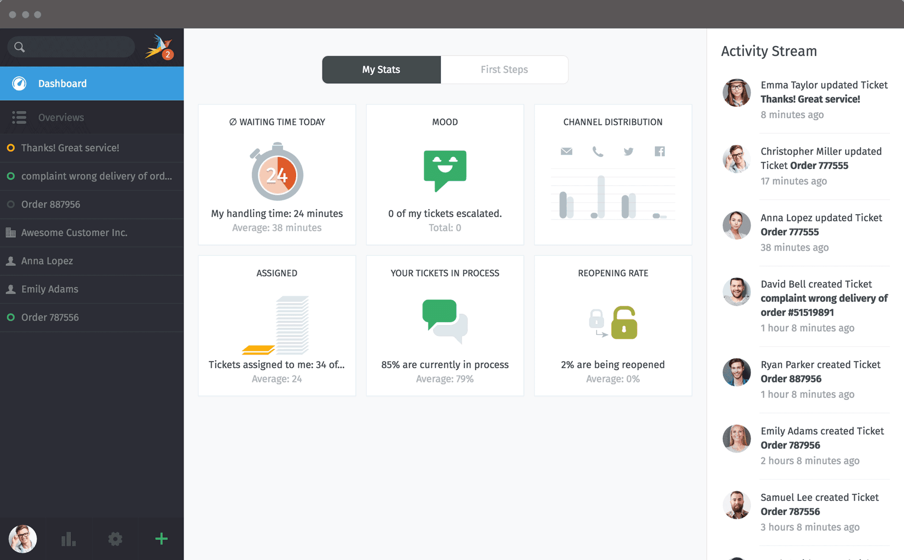

# Zammad CI/CD pipeline

Deploy Zammad with CI/CD on Elestio

 
 

# Once deployed ...

You must now connect to the portal to create your Zammad Administrator account here:
https://[DOMAIN]

In the setup when asked for email sending select "SMTP" then indicate

    host: 172.17.0.1
    user: leave this field empty
    password: leave this field empty
    port: 25

Quickstart guide: https://docs.zammad.org/en/latest/getting-started/first-steps.html

Full documentation for Administrator: https://admin-docs.zammad.org/en/latest/
